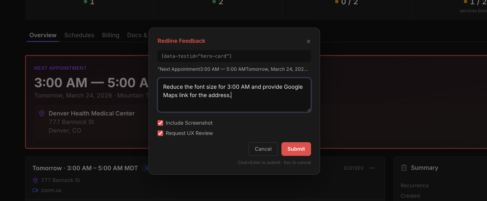

# Redline

**Your UX Feedback Loop Champion**

In-app dev feedback for AI-assisted development. No database — just a JSON file.

## How It Works

1. **Triple-tap `r`** → click any element → type feedback → submit
2. **`/redline fix`** → Claude reads feedback + screenshots, finds the code, fixes it
3. Ship it

Leave as many redlines as you want. Fix them all at once.

## Features

- **Screenshots** — opt-in on submit, captured via `modern-screenshot` (supports Tailwind v4, `oklab()`, modern CSS)
- **Request UX Audit** — opt-in 55-point audit including the Steve Jobs Pitch
- **Flat file** — `redline/feedback.json`. No database
- **Batch fix** — 10 redlines? One command

## The Steve Jobs Pitch

> We're walking into a room to pitch this to Steve Jobs. Will he invest — or will he fire us on the spot?

Is it pitch ready? Will SJ fire us? What questions will he ask? What gaps will he discover? Does it excite him? Does everything work E2E?

## Commands

| Command | What it does |
|---------|-------------|
| `/redline check` | See open feedback |
| `/redline fix` | Fix all open redlines |
| `/redline fix <uuid>` | Fix a specific one |
| `/redline clear` | Clear all feedback |
| `/redline defer <n>` | Defer / list / undo |
| `/redline ux-review` | Standalone UX audit |

## Install

See **[AGENT-INSTALLATION.md](AGENT-INSTALLATION.md)** — paste the prompt into Claude Code and it handles everything.

MIT License
